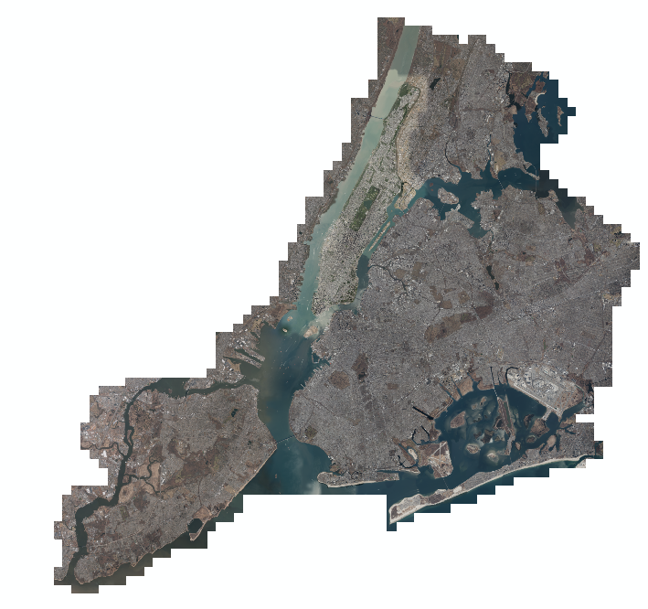

  <h1>Analysis of  the New York City Property Prices Dataset</h1>
  

## Goal

The goal of this project is to predict the selling price of real estate properties in New York. For this propose the data on sales (containing the regular features such as total square feet, address, ...) way extended by visual features extracted from areal photos of the city. 

## Data

The main dataset used in this project is on Real Estate Sales. It contains all the sales that were made in New York City in the year 2015. The data originates from the public NYC Geodatabase. The initial dataset is from the New York City Department of Finance and was extended by geographical information [(More Information)](https://geo.nyu.edu/catalog/nyu-2451-34678). Explanatory details of this dataset can be found [here](https://www1.nyc.gov/assets/finance/downloads/pdf/07pdf/glossary_rsf071607.pdf).

The second dataset used for the analysis is areal images provided by the New York City Department of Information Technology \& Telecommunications. The data was devived in squares so that each property is at the centre of one image [(More Information)](http://gis.ny.gov/gateway/orthoprogram/ortho_options.htm).

## Develop

* Clone the repository: `git clone [repo-url]`

* Add the dataset files to your local repository.

### Automatic Output Clearing

Using the git hook from (https://github.com/kynan/nbstripout)

`pip install nbstripout nbconvert`

`nbstripout --install`